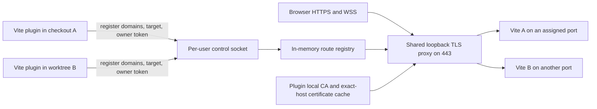

# Plan: Build a Caddyless, Checkout-Aware Vite TLS Plugin

## Outcome

Create a new `@vampaz/vite-plugin-local-tls` npm package in this sibling folder and the independent `vite-plugin-local-tls` repository, delivering the complete functional contract of `vite-plugin-caddy-multiple-tls` without installing, starting, configuring, or communicating with Caddy.

The plugin must let developers run Vite dev or preview servers concurrently from different clones and linked worktrees. Each server must receive a stable HTTPS URL derived from its repository and branch, such as:

```text
https://fieldlock.master.localhost
https://fieldlock.fix-tracking.localhost
https://fieldlock.new-editor.localhost
```

The implementation will use a Portless-style architecture: a shared loopback TLS proxy, a local certificate authority, exact-host routing, and a small local control service. The Vite plugin remains responsible for hostname derivation, actual-port discovery, HMR configuration, route registration, takeover semantics, and cleanup.

This plan creates a new package. It does not modify or deprecate `/Users/carlosrodrigues/works/vite-plugin-caddy-multiple-tls` until the new package has independently passed the complete parity suite and the user confirms it is ready.

## Hard constraints

- Full functional parity is mandatory. An implementation phase is not complete while any current behavior or test scenario is missing.
- Full parity means every observable plugin capability, option outcome, lifecycle guarantee, helper result, and diagnostic in the current unit and E2E suites. Caddy administration concepts that cannot exist without Caddy must receive an explicit replacement capability and migration test; they may not disappear silently.
- The published package must have zero runtime npm dependencies. Vite remains a peer dependency; test, type, formatting, and packaging tools remain development dependencies.
- Do not depend on Portless, Caddy, mkcert, an HTTP proxy package, an X.509 npm package, or another background proxy.
- Use only Node built-ins for the proxy, route control, IPC, HTTP/1.1, HTTP/2, TLS serving, WebSocket bridging, process management, filesystem state, and cryptographic inspection.
- Use the system `openssl` executable to author the local CA and leaf certificates. Node's `X509Certificate` API is read-only and cannot author standards-compliant certificates.
- Use native OS trust tools: `security` on macOS, `update-ca-certificates` or `update-ca-trust` on Linux, and `certutil` on Windows. These are system prerequisites, not npm dependencies.
- Never implement a custom ASN.1/X.509 encoder merely to claim that there are no external executables. That would add security-sensitive code far beyond this plugin's purpose.
- Bind the public proxy only to `127.0.0.1` and `::1` unless a future, separately approved LAN feature is designed.
- Do not expose a TCP administration API. Use a per-user Unix-domain socket on macOS/Linux and a per-user named pipe on Windows.
- Do not silently kill a process occupying port 443. Report the owning listener when possible and leave unrelated services untouched.
- Use ESM only, single quotes, declared functions, and interfaces stored under `src/interfaces/`.
- Do not use `npx`; invoke project tools through npm scripts.
- Preserve the current Changesets, GitHub Actions, npm trusted-publishing, provenance, changelog, tag, GitHub Release, and `latest` dist-tag flow. The only permitted publishing-flow differences are the new package/repository identity, the one-time bootstrap required to create a new npm package, and removal of Caddy-specific E2E setup.
- Do not consider the plugin complete or ready for release until the user confirms the result.

## Runtime dependency boundary

The intended published manifest is:

```json
{
  "dependencies": {},
  "peerDependencies": {
    "vite": "^3.0.0 || ^4.0.0 || ^5.0.0 || ^6.0.0 || ^7.0.0 || ^8.0.0"
  }
}
```

System capabilities are explicit:

| Capability | macOS | Linux | Windows |
| --- | --- | --- | --- |
| Certificate authoring | `openssl` | `openssl` | `openssl` discovered through supported installations |
| CA trust | `security` | `update-ca-certificates`, `update-ca-trust`, or `trust` | `certutil` |
| Git-derived URLs | `git` | `git` | `git` |
| Port 443 | first-run elevation or installed service | capability-aware service or first-run elevation | user process or scheduled service |

Passing an explicit `domain`, `repo`, and `branch` must remain possible when Git is unavailable. HTTPS startup must fail with a precise diagnostic when OpenSSL or the required trust capability is unavailable; it must never downgrade silently to HTTP or an untrusted certificate.

## Publishing parity contract

The new repository must reproduce the existing release path, changing only `vite-plugin-caddy-multiple-tls` to the approved new repository and package names:

1. Every publishable pull request includes a Changesets markdown file declaring `patch`, `minor`, or `major` impact and user-facing release notes.
2. Pull requests targeting `master` run the `Tests` workflow. A push to `master` runs the same workflow again against the exact merged commit.
3. `Tests` retains separate unit/package and reusable E2E jobs on GitHub-hosted Ubuntu with Node 24 and npm lockfile caching. The unit/package job runs install, lint, format check, unit tests, and the package build. The E2E job keeps the current reusable-workflow boundary but replaces Caddy installation with OpenSSL, low-port, trust-store, and caddyless-daemon setup.
4. `release.yml` is triggered only by successful completion of `Tests` on `master`. It checks out `github.event.workflow_run.head_sha`, uses Node 24, upgrades npm to a version that supports OIDC, runs `npm ci`, configures `https://registry.npmjs.org/`, and invokes Changesets.
5. When unreleased Changesets exist, `changesets/action@v1` creates or updates the `Version Packages` pull request. That pull request updates the package version and changelog and consumes the Changesets.
6. Merging the `Version Packages` pull request runs `Tests` again. Only its successful `master` run can trigger publication.
7. Publication uses the npm trusted publisher configured for the exact GitHub owner, repository, and `release.yml` filename. The workflow has `contents: write`, `pull-requests: write`, and `id-token: write`; it passes `publish: npm run changeset:publish` to `changesets/action@v1`, uses `GITHUB_TOKEN` for repository changes, sets `NPM_CONFIG_PROVENANCE: true`, and uses no long-lived npm publish token.
8. A successful publish updates npm's `latest` dist-tag, pushes `@vampaz/vite-plugin-local-tls@<version>`, creates the matching GitHub Release, and publishes npm provenance whose `gitHead` matches the tested `master` commit.
9. A failed, cancelled, skipped, or stale `Tests` run must never publish. Release concurrency must prevent two runs from racing the same version.

The current package already exists on npm, but the new name will not. npm trusted-publisher settings are package-scoped, so the one-time bootstrap is explicit:

- Recheck package-name availability immediately before repository initialization and again before publishing; an earlier availability check is not a reservation.
- After the full acceptance suite and explicit user approval, publish `0.0.1` once using a short-lived granular credential and the same built tarball verification. Do not store the credential in the repository or a permanent GitHub secret.
- Pause for the user to create or confirm the npm package ownership and trusted-publisher settings. Configure the exact GitHub owner, repository, and `release.yml` filename, allow `npm publish`, and do not select an npm environment unless the matching GitHub environment is deliberately added to the workflow.
- After the user confirms those npm settings, verify an OIDC publication, then revoke the bootstrap credential and configure npm to disallow token publishing.
- Use the normal Changesets release pull request for `1.0.0` and every later version. There is no manual local `npm publish`, manually created tag, or manually created GitHub Release after bootstrap.

## Functional parity ledger

Every row must have unit or E2E evidence before release.

| Current feature | New-plugin contract |
| --- | --- |
| Default Git-derived hostname | Preserve `<repo>.<branch>.localhost` for regular clones, primary checkouts, and linked worktrees |
| Explicit `domain` | Preserve one explicit hostname |
| Explicit domain array | Preserve several independently owned hostnames for one Vite instance |
| Domain normalization | Preserve trimming, lowercasing, empty-value rejection, de-duplication, and actionable no-domain diagnostics |
| `baseDomain` | Preserve `<repo>.<branch>.<baseDomain>` derivation |
| `loopbackDomain` | Preserve `localtest.me`, `lvh.me`, and `nip.io` behavior |
| `repo` and `branch` | Preserve Git-detection overrides |
| `instanceLabel` | Preserve deterministic disambiguation, including two checkouts of the same branch |
| DNS-label limits | Preserve deterministic sanitization and hash compaction for labels longer than 63 characters |
| `cors` | Preserve the existing response-header behavior without synthesizing new application responses |
| `internalTls` | Preserve the option and its observable certificate-policy behavior; the detailed mapping below is mandatory |
| `upstreamHostHeader` | Preserve explicit upstream `Host` rewriting |
| Dev server support | Preserve `configureServer` integration |
| Preview support | Preserve `configurePreviewServer` integration |
| Actual bound port | Register the port Vite really selected after auto-increment |
| Resolved and wildcard upstreams | Prefer Vite's resolved local URL where available and map wildcard bind addresses to reachable loopback targets |
| IPv4 and IPv6 upstreams | Route correctly to IPv4-only and IPv6-only Vite listeners |
| Host defaults | Preserve current `server.host`, `server.allowedHosts`, preview host, and preview allowed-host defaults unless separately approved |
| HMR isolation | Preserve WSS on the resolved public hostname and public port 443 |
| User Vite overrides | Preserve explicit host, allowed-host, and HMR/WebSocket settings |
| Infrastructure readiness | Validate prerequisites and start the shared proxy automatically before route registration |
| Latest-started wins | A new owner replaces one reused hostname without stopping the old Vite process |
| Conditional cleanup | An older owner can never remove a hostname after a newer owner takes it over |
| Multi-domain isolation | Reusing one hostname never removes sibling hostnames owned by the older instance |
| Crash recovery | Dead routes disappear and the hostname can restart immediately |
| Signal and close cleanup | SIGINT, SIGTERM, normal server close, and process exit release only currently owned resources |
| Cleanup retry | Transient cleanup failures are retried without deleting a newer owner's route |
| Orphan recovery | Managed proxy/certificate state left by a dead process is reclaimed without touching unrelated state |
| Concurrent starts | Several simultaneous Vite starts cannot lose or overwrite unrelated routes |
| Pure helpers | Export Caddy-neutral domain and URL helpers with the same resolution rules, including `null` for zero or multiple resolved domains |
| Linux hostname guidance | Preserve actionable `.localhost` and loopback-domain guidance |
| Terminal output | Print every public HTTPS URL and the actual upstream target |

### `internalTls` compatibility contract

The current flag controls whether the plugin adds an explicit Caddy internal-issuer policy; Caddy may still choose its local issuer for local names when the flag is false or omitted. The replacement must preserve the observable outcome rather than treating `false` as an ignored value:

- `internalTls: true` forces a leaf issued by this plugin's trusted local CA.
- `internalTls: undefined` preserves today's defaults. Local and loopback names use the daemon's trusted local automation, while explicit custom names follow the same default decision recorded by the phase 1 contract fixtures.
- `internalTls: false` must not create a forced per-route local-CA policy. A local name may still use the daemon's default local certificate automation, matching Caddy's local-host behavior. A custom non-local name must use an exact-host certificate previously imported into the daemon certificate store; if none exists, startup fails with a precise import instruction instead of silently changing certificate policy or downgrading to HTTP.
- The CLI therefore needs exact-host `cert import`, `cert list`, and `cert remove` operations. Imported private keys receive the same filesystem protections as the local CA key, and certificate/key/SAN matching is verified before storage.

This preserves the plugin-level ability to force or avoid its internal issuer without attempting to recreate Caddy's unrelated public ACME platform. Phase 1 must record the current behavior for local, loopback, and custom names before implementation so the mapping cannot drift.

The following Caddy controls are implementation-specific and therefore cannot retain their literal behavior:

| Current option | Replacement |
| --- | --- |
| `caddyApiUrl` | Replacement option `controlSocket`; targets an alternate per-user control socket without exposing an HTTP API |
| `caddyAdminOrigin` | Removed because no HTTP administration API exists |
| `serverName` | Replacement option `serviceNamespace`; isolates state and control-channel names while retaining the shared-proxy safety checks |

No other feature or option may be removed without explicit approval.

## Hostname identity policy

- Different branches use `<repo>.<branch>.<baseDomain>` and therefore run concurrently without configuration.
- Linked worktrees are not special-cased: every checkout resolves its current branch, including the primary checkout.
- Detached HEAD uses the sanitized short commit SHA as the branch label, preserving the current helper behavior.
- Two simultaneous checkouts of the same repository and branch require distinct `instanceLabel` values, producing `<repo>.<branch>.<instanceLabel>.<baseDomain>`.
- Starting a second owner for the exact same resolved hostname retains the current latest-started-wins behavior.
- Branch labels are sanitized deterministically and never contain invalid DNS labels.

## Target architecture



The route registration connection is a lease. Each registration contains a random owner token. Closing the connection removes only routes whose current token still matches. A takeover changes the token atomically, so cleanup from an older process cannot remove the new route.

## Intended repository shape

```text
vite-plugin-local-tls/
├── .changeset/
│   └── config.json
├── .github/
│   └── workflows/
│       ├── tests.yml
│       ├── e2e.yml
│       └── release.yml
├── .husky/
│   └── pre-commit
├── package.json
├── package-lock.json
├── tsconfig.json
├── tsup.config.ts
├── CHANGELOG.md
├── CONTRIBUTING.md
├── README.md
├── SECURITY.md
├── LICENSE
├── src/
│   ├── index.ts
│   ├── plugin.ts
│   ├── domain-resolution.ts
│   ├── checkout-resolution.ts
│   ├── route-registry.ts
│   ├── control-server.ts
│   ├── control-client.ts
│   ├── proxy-server.ts
│   ├── certificates.ts
│   ├── trust-store.ts
│   ├── service.ts
│   ├── daemon.ts
│   ├── cli.ts
│   ├── state-paths.ts
│   └── interfaces/
│       ├── plugin-options.ts
│       ├── route-registration.ts
│       ├── control-message.ts
│       ├── proxy-options.ts
│       └── service-state.ts
├── playground/
│   ├── index.html
│   ├── package.json
│   ├── vite.config.ts
│   └── src/
└── tests/
    ├── contract/
    ├── e2e/
    └── fixtures/
```

Every source test remains adjacent to its source file. Cross-package contract and browser tests live under `tests/` because they exercise the published surface rather than one module.

## Implementation plan

- [x] Phase 1: Establish the package and freeze the compatibility contract

  - [x] Step 1.1: Initialize the standalone ESM package with zero runtime dependencies
    - Objective: Create the package manifest, TypeScript and bundling configuration, npm scripts, ignore rules, license, and a minimal public entry point. Pin only development tooling, declare Vite as a peer, and require the lowest Node 22 release that supports every selected API.
    - Files: `package.json`, `package-lock.json`, `tsconfig.json`, `tsup.config.ts`, `.gitignore`, `LICENSE`, `src/index.ts`, `src/index.spec.ts`
    - Test file: `src/index.spec.ts`
    - Verification: `npm run test -- src/index.spec.ts`
    - Additional verification: `npm run typecheck && npm run lint && npm run format:check`
    - Commit: `chore: initialize caddyless plugin package`

  - [x] Step 1.2: Encode the complete legacy feature ledger as executable contract fixtures
    - Objective: Translate every public option and behavior from the current README, architecture document, unit suite, and E2E suite into backend-neutral contract cases before implementing the new backend. Keep fixtures descriptive enough to identify any omitted feature.
    - Files: `tests/contract/feature-parity.spec.ts`, `tests/fixtures/current-contract.ts`, `tests/fixtures/domain-cases.ts`
    - Test file: `tests/contract/feature-parity.spec.ts`
    - Verification: `npm run test -- tests/contract/feature-parity.spec.ts`
    - Commit: `test: freeze current plugin feature contract`

  - [x] Step 1.3: Implement Caddy-neutral domain resolution helpers test-first
    - Objective: Port the current normalization, repository/branch derivation, explicit domain arrays, base domains, loopback domains, labels, warnings, and single-URL behavior. Export `resolveLocalTlsDomains()` and `resolveLocalTlsUrl()`.
    - Files: `src/domain-resolution.ts`, `src/domain-resolution.spec.ts`, `src/interfaces/plugin-options.ts`, `src/index.ts`
    - Test file: `src/domain-resolution.spec.ts`
    - Verification: `npm run test -- src/domain-resolution.spec.ts`
    - Commit: `feat: resolve checkout-aware local TLS domains`

  - [x] Step 1.4: Resolve regular clones, primary checkouts, linked worktrees, and detached HEADs consistently
    - Objective: Always resolve the current branch rather than only recognizing linked worktrees. Cover nested working directories, Git-unavailable fallbacks, slash-containing branches, detached commits represented by the current short-SHA rule, explicit overrides, and identical branches disambiguated with `instanceLabel`.
    - Files: `src/checkout-resolution.ts`, `src/checkout-resolution.spec.ts`, `src/domain-resolution.ts`
    - Test file: `src/checkout-resolution.spec.ts`
    - Verification: `npm run test -- src/checkout-resolution.spec.ts`
    - Commit: `feat: identify every checkout and worktree branch`

- [x] Phase 2: Build an ownership-safe route control plane

  - [x] Step 2.1: Define and validate the control protocol
    - Objective: Define versioned register, unregister, heartbeat, route-lost, health, and error messages. Validate all untrusted messages, ports, hostnames, owner tokens, upstream hosts, CORS values, and Host overrides before changing state.
    - Files: `src/interfaces/control-message.ts`, `src/interfaces/route-registration.ts`, `src/control-protocol.ts`, `src/control-protocol.spec.ts`
    - Test file: `src/control-protocol.spec.ts`
    - Verification: `npm run test -- src/control-protocol.spec.ts`
    - Commit: `feat: define local proxy control protocol`

  - [x] Step 2.2: Implement independent per-hostname ownership and atomic latest-started takeover
    - Objective: Store each hostname independently in memory. Registering a reused hostname atomically replaces only that hostname, preserves all siblings, and notifies the displaced owner. Conditional removal must require the active owner token.
    - Files: `src/route-registry.ts`, `src/route-registry.spec.ts`, `src/interfaces/route-registration.ts`
    - Test file: `src/route-registry.spec.ts`
    - Verification: `npm run test -- src/route-registry.spec.ts`
    - Commit: `feat: add owner-token route registry`

  - [x] Step 2.3: Implement the Unix-domain socket and Windows named-pipe server
    - Objective: Accept multiple concurrent local clients, enforce per-user access, parse framed messages safely, serialize mutations through the daemon event loop, and reject incompatible protocol versions. Do not expose a network admin port.
    - Files: `src/control-server.ts`, `src/control-server.spec.ts`, `src/state-paths.ts`, `src/interfaces/service-state.ts`
    - Test file: `src/control-server.spec.ts`
    - Verification: `npm run test -- src/control-server.spec.ts`
    - Commit: `feat: expose per-user proxy control channel`

  - [x] Step 2.4: Implement the plugin-side control client and connection lease
    - Objective: Connect, register several domains as independent claims, receive takeover notifications, unregister conditionally, and release remaining claims when the connection closes. Support bounded reconnects without hiding persistent failure.
    - Files: `src/control-client.ts`, `src/control-client.spec.ts`, `src/interfaces/control-message.ts`
    - Test file: `src/control-client.spec.ts`
    - Verification: `npm run test -- src/control-client.spec.ts`
    - Commit: `feat: add leased route registration client`

  - [x] Step 2.5: Prove crash, disconnect, stale socket, and concurrent registration recovery
    - Objective: Spawn real child clients, terminate them normally and forcibly, race multiple claims, leave a stale socket path, and verify that only dead ownership is removed. A live unrelated registration must survive every scenario.
    - Files: `src/control-lifecycle.spec.ts`, `tests/fixtures/control-client-process.ts`
    - Test file: `src/control-lifecycle.spec.ts`
    - Verification: `npm run test -- src/control-lifecycle.spec.ts`
    - Commit: `test: prove route lease crash recovery`

- [x] Phase 3: Implement the dependency-free shared proxy

  - [x] Step 3.1: Proxy streaming HTTP/1.1 requests by exact Host
    - Objective: Use `node:http` to forward methods, paths, query strings, streaming bodies, streaming responses, status, duplicate headers, cookies, trailers, aborts, and errors. Normalize Host case and explicit default ports. Return a safe diagnostic for unknown hosts.
    - Files: `src/proxy-server.ts`, `src/proxy-server.spec.ts`, `src/interfaces/proxy-options.ts`
    - Test file: `src/proxy-server.spec.ts`
    - Verification: `npm run test -- src/proxy-server.spec.ts`
    - Commit: `feat: proxy exact-host HTTP traffic`

  - [x] Step 3.2: Preserve forwarded headers, CORS behavior, and upstream Host overrides
    - Objective: Match the current plugin's `cors` and `upstreamHostHeader` semantics and proxy `X-Forwarded-For`, `X-Forwarded-Host`, `X-Forwarded-Port`, and `X-Forwarded-Proto` consistently. Prevent proxy loops without modifying unrelated application responses.
    - Files: `src/proxy-server.ts`, `src/proxy-headers.spec.ts`
    - Test file: `src/proxy-headers.spec.ts`
    - Verification: `npm run test -- src/proxy-headers.spec.ts`
    - Commit: `feat: preserve proxy header behavior`

  - [x] Step 3.3: Bridge HTTP/1.1 WebSocket upgrades without a proxy dependency
    - Objective: Forward the original handshake, validate backend upgrade responses, preserve subprotocol and extension negotiation, forward buffered heads, pipe both directions, and terminate both sockets on error or close. Cover Vite HMR handshakes and ordinary application WebSockets.
    - Files: `src/proxy-server.ts`, `src/proxy-websocket.spec.ts`, `tests/fixtures/websocket-backend.ts`
    - Test file: `src/proxy-websocket.spec.ts`
    - Verification: `npm run test -- src/proxy-websocket.spec.ts`
    - Commit: `feat: proxy websocket upgrades`

  - [x] Step 3.4: Add HTTP/2 TLS compatibility and RFC 8441 WebSocket bridging
    - Objective: Use `node:http2.createSecureServer()` with `allowHTTP1`, translate HTTP/2 headers to the HTTP/1.1 Vite upstream, strip hop-by-hop headers, support extended CONNECT, verify the synthesized WebSocket accept hash, and preserve streaming semantics.
    - Files: `src/proxy-server.ts`, `src/proxy-http2.spec.ts`, `src/proxy-http2-websocket.spec.ts`
    - Test files: `src/proxy-http2.spec.ts`, `src/proxy-http2-websocket.spec.ts`
    - Verification: `npm run test -- src/proxy-http2.spec.ts src/proxy-http2-websocket.spec.ts`
    - Commit: `feat: serve HTTP2 and extended-connect websockets`

  - [x] Step 3.5: Bind IPv4 and IPv6 loopback listeners safely
    - Objective: Serve the same registry on `127.0.0.1` and `::1`, reach IPv4-only and IPv6-only upstreams, avoid LAN exposure, report partial-stack failures precisely, and detect a non-plugin listener already occupying the configured public port.
    - Files: `src/proxy-listeners.ts`, `src/proxy-listeners.spec.ts`, `src/proxy-server.ts`
    - Test file: `src/proxy-listeners.spec.ts`
    - Verification: `npm run test -- src/proxy-listeners.spec.ts`
    - Commit: `feat: bind loopback-only proxy listeners`

- [x] Phase 4: Generate, cache, trust, and remove local certificates

  - [x] Step 4.1: Create secure state paths and diagnose system prerequisites
    - Objective: Select per-user state and runtime paths on macOS, Linux, WSL, and Windows; create private directories; enforce CA-key permissions; locate OpenSSL and trust tools; and emit actionable, platform-specific diagnostics.
    - Files: `src/state-paths.ts`, `src/state-paths.spec.ts`, `src/system-requirements.ts`, `src/system-requirements.spec.ts`
    - Test files: `src/state-paths.spec.ts`, `src/system-requirements.spec.ts`
    - Verification: `npm run test -- src/state-paths.spec.ts src/system-requirements.spec.ts`
    - Commit: `feat: validate local TLS system requirements`

  - [x] Step 4.2: Generate and validate the local CA with OpenSSL
    - Objective: Generate an ECDSA CA with CA constraints, strong signatures, bounded validity, secure key permissions, atomic writes, fingerprint tracking, expiration checks, and safe regeneration rules. Never overwrite an installed CA merely because a leaf needs renewal.
    - Files: `src/certificates.ts`, `src/certificates.spec.ts`
    - Test file: `src/certificates.spec.ts`
    - Verification: `npm run test -- src/certificates.spec.ts`
    - Commit: `feat: create plugin local certificate authority`

  - [x] Step 4.3: Issue exact-host leaf certificates and select them with SNI
    - Objective: Generate certificates only for validated, registered hostnames; include the exact SAN; cache them by collision-resistant hostname key; deduplicate concurrent generation; renew before expiration; include the CA chain; and reject unknown SNI names rather than acting as an unrestricted signing oracle. Encode and test the `internalTls` true, false, and omitted policy for local, loopback, and custom domains exactly as frozen in phase 1.
    - Files: `src/certificates.ts`, `src/certificate-policy.ts`, `src/certificate-sni.spec.ts`, `src/certificate-policy.spec.ts`, `src/proxy-server.ts`
    - Test files: `src/certificate-sni.spec.ts`, `src/certificate-policy.spec.ts`
    - Verification: `npm run test -- src/certificate-sni.spec.ts src/certificate-policy.spec.ts`
    - Commit: `feat: serve exact-host TLS certificates`

  - [x] Step 4.4: Import and manage exact-host external certificates without npm dependencies
    - Objective: Implement the `internalTls: false` custom-domain path. Accept certificate, chain, and private-key files through the CLI; inspect them with OpenSSL and Node; require key/certificate and SAN matches; copy them atomically into private state; select them only for their exact registered hostnames; and remove only the requested imported material.
    - Files: `src/certificate-import.ts`, `src/certificate-import.spec.ts`, `src/certificates.ts`, `src/interfaces/certificate-record.ts`
    - Test file: `src/certificate-import.spec.ts`
    - Verification: `npm run test -- src/certificate-import.spec.ts`
    - Commit: `feat: manage imported exact-host certificates`

  - [x] Step 4.5: Install, verify, and remove CA trust on macOS
    - Objective: Use argument-array child processes for `security`, target the intended keychain, verify the exact fingerprint rather than trusting marker files alone, handle authorization timeouts, and remove only this plugin's CA.
    - Files: `src/trust-store.ts`, `src/trust-store-macos.spec.ts`
    - Test file: `src/trust-store-macos.spec.ts`
    - Verification: `npm run test -- src/trust-store-macos.spec.ts`
    - Commit: `feat: manage macos CA trust`

  - [x] Step 4.6: Install, verify, and remove CA trust across supported Linux stores and WSL
    - Objective: Detect Debian/Ubuntu, Fedora/RHEL/CentOS, Arch, and openSUSE trust mechanisms; use elevation only for the exact trust operation; refresh the store; support WSL's Windows browser store; and leave recoverable state when removal partially fails.
    - Files: `src/trust-store.ts`, `src/trust-store-linux.spec.ts`, `src/trust-store-wsl.spec.ts`
    - Test files: `src/trust-store-linux.spec.ts`, `src/trust-store-wsl.spec.ts`
    - Verification: `npm run test -- src/trust-store-linux.spec.ts src/trust-store-wsl.spec.ts`
    - Commit: `feat: manage linux and WSL CA trust`

  - [x] Step 4.7: Install, verify, and remove CA trust on Windows
    - Objective: Use `certutil` with the current-user Root store by default, handle paths safely, verify the exact CA fingerprint, support cleanup retries, and avoid removing another certificate with a similar display name.
    - Files: `src/trust-store.ts`, `src/trust-store-windows.spec.ts`
    - Test file: `src/trust-store-windows.spec.ts`
    - Verification: `npm run test -- src/trust-store-windows.spec.ts`
    - Commit: `feat: manage windows CA trust`

- [x] Phase 5: Compose the daemon and safe lifecycle tooling

  - [x] Step 5.1: Compose the proxy, registry, certificates, and control server into one daemon
    - Objective: Start components in a fail-closed order, acknowledge readiness only after TLS listeners and the control channel are active, write versioned PID/state metadata atomically, shut down cleanly, and leave no route or socket state after termination.
    - Files: `src/daemon.ts`, `src/daemon.spec.ts`, `src/interfaces/service-state.ts`
    - Test file: `src/daemon.spec.ts`
    - Verification: `npm run test -- src/daemon.spec.ts`
    - Commit: `feat: compose local TLS proxy daemon`

  - [x] Step 5.2: Coordinate singleton startup across simultaneous Vite processes
    - Objective: Use a bounded startup lock, distinguish a healthy daemon from stale metadata or an unrelated listener, let only one process start the daemon, and let all waiting clients connect without losing registrations.
    - Files: `src/service.ts`, `src/service.spec.ts`, `src/daemon.ts`
    - Test file: `src/service.spec.ts`
    - Verification: `npm run test -- src/service.spec.ts`
    - Commit: `feat: coordinate shared daemon startup`

  - [x] Step 5.3: Add protocol-version negotiation and safe daemon replacement
    - Objective: Support projects using different plugin versions concurrently. Reject incompatible clients clearly, restart an incompatible daemon only when it has no live owners, and never interrupt active routes merely to upgrade the daemon.
    - Files: `src/service.ts`, `src/service-version.spec.ts`, `src/control-protocol.ts`
    - Test file: `src/service-version.spec.ts`
    - Verification: `npm run test -- src/service-version.spec.ts`
    - Commit: `feat: negotiate shared daemon versions`

  - [x] Step 5.4: Add the minimal CLI required for trust, certificates, health, service, and cleanup
    - Objective: Ship a `vite-local-tls` binary with `trust`, `untrust`, `cert import`, `cert list`, `cert remove`, `doctor`, `proxy start`, `proxy stop`, `proxy status`, `service install`, `service uninstall`, and `clean`. Keep it focused on infrastructure; do not turn it into a general command runner like Portless.
    - Files: `src/cli.ts`, `src/cli.spec.ts`, `package.json`
    - Test file: `src/cli.spec.ts`
    - Verification: `npm run test -- src/cli.spec.ts`
    - Commit: `feat: add local TLS infrastructure CLI`

  - [x] Step 5.5: Install least-privilege startup services for port 443
    - Objective: Generate and manage launchd, systemd, and Windows Task Scheduler definitions. Prefer running as the installing user with only the privilege needed to bind 443; where a root bootstrap is unavoidable, bind first and drop privileges before accepting control messages. Preserve exact state ownership and never alter unrelated services.
    - Files: `src/service-install.ts`, `src/service-install-macos.spec.ts`, `src/service-install-linux.spec.ts`, `src/service-install-windows.spec.ts`, `src/interfaces/service-state.ts`
    - Test files: `src/service-install-macos.spec.ts`, `src/service-install-linux.spec.ts`, `src/service-install-windows.spec.ts`
    - Verification: `npm run test -- src/service-install-macos.spec.ts src/service-install-linux.spec.ts src/service-install-windows.spec.ts`
    - Commit: `feat: install least-privilege proxy service`

  - [x] Step 5.6: Auto-start the daemon with clear interactive and non-interactive behavior
    - Objective: Match the current zero-setup startup as closely as platform security permits. Start directly when port 443 is available, perform a bounded first-run trust/elevation flow only in an interactive terminal, and fail early with the exact `vite-local-tls service install` or `trust` command in CI/non-interactive contexts.
    - Files: `src/service.ts`, `src/service-autostart.spec.ts`, `src/cli.ts`
    - Test file: `src/service-autostart.spec.ts`
    - Verification: `npm run test -- src/service-autostart.spec.ts`
    - Commit: `feat: auto-start local TLS infrastructure`

- [x] Phase 6: Integrate the complete Vite plugin contract

  - [x] Step 6.1: Implement the public plugin options and Vite configuration defaults
    - Objective: Expose all functional options from the parity ledger plus the Caddy-neutral `controlSocket` and `serviceNamespace` replacements, default dev and preview host/allowed-host behavior exactly as the current plugin does, configure `server.hmr` WSS settings for the first resolved domain, respect user overrides, and support Vite 3 through 8 through version-specific contract tests rather than unverified API assumptions.
    - Files: `src/plugin.ts`, `src/plugin-config.spec.ts`, `src/interfaces/plugin-options.ts`, `src/index.ts`
    - Test file: `src/plugin-config.spec.ts`
    - Verification: `npm run test -- src/plugin-config.spec.ts`
    - Commit: `feat: configure Vite for shared local TLS`

  - [x] Step 6.2: Register the actual dev-server upstream after Vite listens
    - Objective: Prefer Vite's resolved local URL, otherwise map IPv4/IPv6 wildcard binds to reachable loopback hosts, and use the actual port after Vite auto-increment. Ensure the daemon is ready, register every resolved hostname independently, print the upstream and URLs, and roll back only claims from a partially failed setup.
    - Files: `src/plugin.ts`, `src/plugin-dev-server.spec.ts`, `src/control-client.ts`
    - Test file: `src/plugin-dev-server.spec.ts`
    - Verification: `npm run test -- src/plugin-dev-server.spec.ts`
    - Commit: `feat: register Vite dev server routes`

  - [x] Step 6.3: Preserve latest-started takeover and multi-domain sibling isolation through the plugin
    - Objective: Verify plugin-visible behavior when another live server takes one or all hostnames, surface lost ownership clearly, leave the old Vite process running, and ensure old shutdown cannot remove the new route. Cover normal close, SIGINT, SIGTERM, transient cleanup retries, heartbeat/lease loss, and orphan reclamation without disturbing a current owner or sibling route.
    - Files: `src/plugin-ownership.spec.ts`, `src/plugin.ts`
    - Test file: `src/plugin-ownership.spec.ts`
    - Verification: `npm run test -- src/plugin-ownership.spec.ts`
    - Commit: `feat: preserve hostname takeover semantics`

  - [x] Step 6.4: Integrate Vite preview with identical routing and cleanup
    - Objective: Resolve preview host and port, register after preview listens, use the same domains and proxy options, print preview URLs, and release only preview-owned claims on shutdown.
    - Files: `src/plugin.ts`, `src/plugin-preview.spec.ts`
    - Test file: `src/plugin-preview.spec.ts`
    - Verification: `npm run test -- src/plugin-preview.spec.ts`
    - Commit: `feat: proxy Vite preview over local TLS`

  - [x] Step 6.5: Recover active Vite registrations after daemon restart
    - Objective: Detect control-channel loss, perform bounded daemon recovery, re-register the same owner claims without changing public URLs, and show a prominent error if recovery cannot succeed. Never leave HMR silently disconnected.
    - Files: `src/plugin.ts`, `src/plugin-reconnect.spec.ts`, `src/control-client.ts`
    - Test file: `src/plugin-reconnect.spec.ts`
    - Verification: `npm run test -- src/plugin-reconnect.spec.ts`
    - Commit: `feat: recover routes after daemon restart`

- [x] Phase 7: Prove full parity with real servers, checkouts, and worktrees

  - [x] Step 7.1: Create a real Vite playground and trusted-TLS smoke path
    - Objective: Add a minimal app that reports its checkout, branch, URL, protocol, and HMR state. Run the built plugin as an installed package, not through source-only shortcuts.
    - Files: `playground/package.json`, `playground/vite.config.ts`, `playground/index.html`, `playground/src/main.ts`, `tests/e2e/playwright.config.ts`, `tests/e2e/smoke.spec.ts`
    - Test file: `tests/e2e/smoke.spec.ts`
    - Verification: `npm run test:e2e -- tests/e2e/smoke.spec.ts`
    - Commit: `test: add local TLS playground smoke coverage`

  - [x] Step 7.2: Run simultaneous servers from regular clones and linked worktrees
    - Objective: Create temporary Git repositories, independent clones, and linked worktrees on distinct branches; start every server concurrently; verify unique branch-based URLs, distinct page markers, distinct storage origins, and isolated HMR connections.
    - Files: `tests/e2e/checkout-isolation.spec.ts`, `tests/fixtures/create-checkouts.ts`, `tests/fixtures/server-process.ts`
    - Test file: `tests/e2e/checkout-isolation.spec.ts`
    - Verification: `npm run test:e2e -- tests/e2e/checkout-isolation.spec.ts`
    - Commit: `test: prove checkout and worktree isolation`

  - [x] Step 7.3: Prove same-branch disambiguation with `instanceLabel`
    - Objective: Run two independent copies of the same branch with different labels and verify both remain reachable. Also prove that omitting labels retains deterministic latest-started takeover rather than inventing an unstable URL.
    - Files: `tests/e2e/instance-label.spec.ts`
    - Test file: `tests/e2e/instance-label.spec.ts`
    - Verification: `npm run test:e2e -- tests/e2e/instance-label.spec.ts`
    - Commit: `test: cover same-branch checkout labels`

  - [x] Step 7.4: Port the complete takeover, sibling, crash, and concurrent-start E2E suite
    - Objective: Recreate every current isolation scenario: reused live hostname, four simultaneous distinct hostnames, partial multi-domain takeover, SIGINT restart, SIGTERM cleanup, SIGKILL recovery, stale daemon state, and concurrent startup.
    - Files: `tests/e2e/route-ownership.spec.ts`, `tests/fixtures/server-process.ts`
    - Test file: `tests/e2e/route-ownership.spec.ts`
    - Verification: `npm run test:e2e -- tests/e2e/route-ownership.spec.ts`
    - Commit: `test: port route ownership end-to-end coverage`

  - [x] Step 7.5: Prove every domain mode and proxy option end to end
    - Objective: Exercise default domains, explicit single and multiple domains, normalization and invalid-domain diagnostics, custom base domains, long hashed labels, all loopback-domain modes, repo/branch overrides, CORS, every `internalTls` certificate-policy mode, imported custom certificates, upstream Host rewriting, resolved local URLs, wildcard binds, IPv4-only upstreams, and IPv6-only upstreams.
    - Files: `tests/e2e/domain-matrix.spec.ts`, `tests/e2e/proxy-options.spec.ts`
    - Test files: `tests/e2e/domain-matrix.spec.ts`, `tests/e2e/proxy-options.spec.ts`
    - Verification: `npm run test:e2e -- tests/e2e/domain-matrix.spec.ts tests/e2e/proxy-options.spec.ts`
    - Commit: `test: prove domain and proxy option parity`

  - [x] Step 7.6: Prove HMR, application WebSockets, preview, and auto-port behavior
    - Objective: Verify WSS HMR updates only the intended checkout, proxy an application WebSocket, run preview over HTTPS, and occupy the requested Vite port so registration must use the auto-incremented port.
    - Files: `tests/e2e/hmr.spec.ts`, `tests/e2e/websocket.spec.ts`, `tests/e2e/preview.spec.ts`, `tests/e2e/auto-port.spec.ts`
    - Test files: `tests/e2e/hmr.spec.ts`, `tests/e2e/websocket.spec.ts`, `tests/e2e/preview.spec.ts`, `tests/e2e/auto-port.spec.ts`
    - Verification: `npm run test:e2e -- tests/e2e/hmr.spec.ts tests/e2e/websocket.spec.ts tests/e2e/preview.spec.ts tests/e2e/auto-port.spec.ts`
    - Commit: `test: prove realtime and preview parity`

  - [x] Step 7.7: Run the supported Vite-version matrix
    - Objective: Execute the contract and focused browser suite against the latest releases in every declared Vite major. Use isolated fixture installs, never `npx`, and update the peer range if a major cannot be supported honestly.
    - Files: `tests/e2e/run-vite-matrix.sh`, `tests/fixtures/vite-versions/`, `package.json`
    - Test file: `tests/contract/vite-version-contract.spec.ts`
    - Verification: `npm run test:e2e:matrix`
    - Commit: `test: verify supported Vite majors`

  - [x] Step 7.8: Prove the package has no runtime npm or Caddy dependency
    - Objective: Inspect the packed artifact and its manifest, install it into a clean fixture, run with no Caddy/Portless/mkcert binaries available, and prove the source never invokes or imports those tools. Keep OpenSSL and OS trust requirements explicit.
    - Files: `scripts/verify-zero-runtime-dependencies.mjs`, `tests/contract/zero-dependencies.spec.ts`, `package.json`
    - Test file: `tests/contract/zero-dependencies.spec.ts`
    - Verification: `npm run verify:zero-deps`
    - Additional verification: `npm pack --dry-run && npm ls --omit=dev`
    - Commit: `test: enforce zero runtime dependencies`

- [x] Phase 8: Document, secure, package, and review the complete replacement

  - [x] Step 8.1: Write usage and complete option documentation
    - Objective: Document zero-config use, every preserved option, clone/worktree URLs, same-branch labels, multiple domains, preview, Linux resolution, trust commands, service commands, diagnostics, and uninstall behavior. Examples must use the new Caddy-neutral API names.
    - Files: `README.md`, `tests/contract/readme-examples.spec.ts`
    - Test file: `tests/contract/readme-examples.spec.ts`
    - Verification: `npm run test -- tests/contract/readme-examples.spec.ts`
    - Commit: `docs: document caddyless local TLS plugin`

  - [x] Step 8.2: Document security boundaries and certificate limitations
    - Objective: Explain CA-key sensitivity, loopback-only binding, control-socket permissions, exact-host issuance, trust removal, port-443 privilege, DNS behavior, and the fact that embedded browsers may use a separate trust profile. Do not promise that removing Caddy alone fixes every embedded-browser certificate rejection.
    - Files: `SECURITY.md`, `README.md`, `tests/contract/security-docs.spec.ts`
    - Test file: `tests/contract/security-docs.spec.ts`
    - Verification: `npm run test -- tests/contract/security-docs.spec.ts`
    - Commit: `docs: define local CA security boundaries`

  - [x] Step 8.3: Write the migration guide and explicit Caddy-option mapping
    - Objective: Map every old import, helper, option, terminal behavior, and operational command to the new plugin. Call out only the three meaningless Caddy administration settings as removed and explain their control-channel replacement.
    - Files: `MIGRATION.md`, `tests/contract/migration-completeness.spec.ts`
    - Test file: `tests/contract/migration-completeness.spec.ts`
    - Verification: `npm run test -- tests/contract/migration-completeness.spec.ts`
    - Commit: `docs: add complete Caddy migration guide`

  - [x] Step 8.4: Verify the distributable artifact and executable entry points
    - Objective: Build because packaging is directly affected, inspect exports and type declarations, install the tarball into a clean Vite fixture, invoke the CLI from the installed package, and confirm certificate templates or other required runtime assets are included.
    - Files: `scripts/verify-package.mjs`, `tests/package/install.spec.ts`, `package.json`, `tsup.config.ts`
    - Test file: `tests/package/install.spec.ts`
    - Verification: `npm run build && npm run test -- tests/package/install.spec.ts && npm run verify:package`
    - Commit: `chore: verify publishable plugin artifact`

  - [x] Step 8.5: Perform the full-parity review loop before release configuration is accepted
    - Objective: Run all verification, compare every ledger row against evidence, inspect every changed file for unnecessary code, confirm no unused imports or orphaned assets, confirm no unrelated process is touched, and repeat until the full suite is green. Do not publish, tag, or create a release; record the evidence needed for the user acceptance gate.
    - Files: all files changed by prior phases; no new feature work
    - Test files: all unit, contract, package, and E2E tests
    - Verification: `npm run typecheck && npm run lint && npm run format:check && npm run test && npm run test:e2e && npm run test:e2e:matrix && npm run verify:zero-deps && npm run verify:package`
    - Additional verification: `git diff --check`
    - Commit: `chore: complete caddyless parity verification`

- [ ] Phase 9: Reproduce the existing Changesets and trusted-publishing flow

  - [x] Step 9.1: Mirror the current release metadata, Changesets policy, changelog, and package hooks
    - Objective: Configure Changesets with `master`, public access, the standard Changesets changelog, `commit: false`, no fixed or linked groups, patch updates for internal dependencies, and no ignored packages. Add the current `changeset`, `changeset:version`, and `changeset:publish` scripts; public package metadata; `files`, ESM exports and types; `prepublishOnly`; packaged README behavior; changelog; and the existing Husky pre-commit format/lint/restage behavior. Change only package/repository identity and Caddy-specific descriptions.
    - Files: `.changeset/config.json`, `.husky/pre-commit`, `package.json`, `package-lock.json`, `CHANGELOG.md`, `CONTRIBUTING.md`, `README.md`, `tests/release/release-metadata.spec.ts`
    - Test file: `tests/release/release-metadata.spec.ts`
    - Verification: `npm run test -- tests/release/release-metadata.spec.ts && npm run changeset -- status`
    - Commit: `chore: configure changesets release metadata`

  - [x] Step 9.2: Recreate the pull-request and master test gates
    - Objective: Add the `Tests` workflow for pull requests and pushes targeting `master`, with `cancel-in-progress: true`, the same workflow/ref concurrency key, and separate unit/package plus reusable E2E jobs. Use `actions/checkout@v7`, `actions/setup-node@v7`, `actions/cache@v6`, GitHub-hosted Ubuntu, Node 24, npm lockfile caching, `npm ci`, lint, format check, unit tests, and the package build. Adapt only the E2E prerequisites: no Caddy installation; provide OpenSSL, permission to bind the isolated test listener, and a disposable CA/browser trust setup, then run the complete caddyless E2E suite.
    - Files: `.github/workflows/tests.yml`, `.github/workflows/e2e.yml`, `tests/release/tests-workflow.spec.ts`, `tests/e2e/package.json`, `package.json`
    - Test file: `tests/release/tests-workflow.spec.ts`
    - Verification: `npm run test -- tests/release/tests-workflow.spec.ts && npm run verify:workflows`
    - Commit: `ci: gate pull requests and master releases`

  - [x] Step 9.3: Recreate the successful-tests-only release workflow
    - Objective: Mirror the current `workflow_run` trigger for completed `Tests` runs on `master`, success conclusion guard, `cancel-in-progress: true`, the workflow/ref concurrency key, exact `head_sha` checkout through `actions/checkout@v7`, Node 24 through `actions/setup-node@v7`, latest npm upgrade for OIDC support, `npm ci`, npm registry configuration, and `changesets/action@v1` with `publish: npm run changeset:publish`. Preserve `GITHUB_TOKEN`, `NPM_CONFIG_PROVENANCE: true`, and `contents`, `pull-requests`, and `id-token` write permissions. Add regression fixtures proving failed/cancelled tests, PR-only test runs, stale SHAs, and duplicate release runs cannot publish.
    - Files: `.github/workflows/release.yml`, `tests/release/release-workflow.spec.ts`, `tests/fixtures/workflow-events/`
    - Test file: `tests/release/release-workflow.spec.ts`
    - Verification: `npm run test -- tests/release/release-workflow.spec.ts && npm run verify:workflows`
    - Commit: `ci: publish through changesets and npm OIDC`

  - [x] Step 9.4: Document the identical contributor and release-PR lifecycle
    - Objective: Document when a Changeset is required, semantic bump selection, local status checks, the `Version Packages` pull request, the second test run after merging it, automatic tag/GitHub Release/npm publication, rollback policy, and the prohibition on manual tags or local publishes after bootstrap. Include the required GitHub setting that allows Actions to create pull requests.
    - Files: `CONTRIBUTING.md`, `README.md`, `RELEASING.md`, `tests/release/release-docs.spec.ts`
    - Test file: `tests/release/release-docs.spec.ts`
    - Verification: `npm run test -- tests/release/release-docs.spec.ts`
    - Commit: `docs: document changesets publishing flow`

  - [x] Step 9.5: Add dry-run and post-publication verification without publishing
    - Objective: Build and pack the exact artifact, reject unexpected files or runtime dependencies, install it into a clean Vite fixture, and add a registry verifier for version, `latest`, `gitHead`, provenance attestations, tag, and GitHub Release. The dry run must be safe before credentials exist and must never call `npm publish`.
    - Files: `scripts/verify-release-dry-run.mjs`, `scripts/verify-published-release.mjs`, `tests/release/release-artifact.spec.ts`, `package.json`
    - Test file: `tests/release/release-artifact.spec.ts`
    - Verification: `npm run verify:release-dry-run && npm run test -- tests/release/release-artifact.spec.ts`
    - Commit: `test: verify release artifacts and provenance`

  - [ ] Step 9.6: Bootstrap the npm package once, then prove the normal `1.0.0` flow
    - Objective: This step is blocked until the user explicitly approves publication and assists with the npm account settings. Recheck the npm name, GitHub repository identity, clean tested commit, and dry-run artifact; publish `0.0.1` once with a short-lived granular credential; pause while the user configures the exact package owner and trusted publisher for the GitHub owner, repository, and `release.yml` with `npm publish` allowed; verify the configuration before continuing; revoke the credential and disallow token publishing; then use a Changeset and the normal `Version Packages` pull request to publish `1.0.0` through OIDC. Verify npm `latest`, provenance, `gitHead`, package tag, GitHub Release, and a clean consumer install before reporting success.
    - Files: `.changeset/<initial-release-slug>.md`; version and `CHANGELOG.md` changes are generated by the Changesets release pull request
    - Test files: all verification suites plus the published-release verifier
    - Verification: `npm run verify:release-dry-run && npm run verify:published -- @vampaz/vite-plugin-local-tls@0.0.1 && npm run verify:published -- @vampaz/vite-plugin-local-tls@1.0.0`
    - Commit: Changesets creates the `Version Packages` release commit; no manual release commit or tag

## Release acceptance checklist

- [x] Every row in the functional parity ledger links to passing unit or E2E evidence.
- [x] At least four simultaneous Vite servers run on independent HTTPS branch URLs.
- [x] Independent clones and linked worktrees both work.
- [x] The same branch can run twice with distinct `instanceLabel` values.
- [x] Latest-started takeover cannot be undone by old-owner cleanup.
- [x] Multi-domain sibling routes survive partial takeover and shutdown.
- [x] HTTP/1.1, HTTP/2, Vite HMR, application WebSockets, streaming, preview, and auto-port selection pass.
- [ ] macOS, Linux, WSL, and Windows trust/service adapters have unit coverage and live platform evidence before claiming support.
- [x] The proxy binds only to IPv4 and IPv6 loopback addresses.
- [x] The CA key is never world-readable and unknown SNI names are not issued certificates.
- [x] The installed package has no runtime npm dependencies and no Portless, Caddy, or mkcert runtime requirement.
- [x] Missing OpenSSL, Git, trust tooling, port privileges, and port conflicts produce precise errors without silent fallback.
- [x] `internalTls` true, false, and omitted pass the frozen local, loopback, and custom-domain certificate-policy matrix; imported keys and certificates are exact-host validated and private.
- [x] The packed package installs in a clean Vite fixture and exposes valid ESM, types, plugin, and CLI entry points.
- [ ] Every publishable change requires a Changeset and the `Version Packages` pull request is generated through the same Changesets action flow.
- [x] Pull requests and `master` run the same Tests gate; release checks out the exact successful Tests `head_sha` and cannot run after a failed, cancelled, or stale result.
- [ ] npm publication uses the configured `release.yml` trusted publisher, no long-lived publish token, and produces provenance whose `gitHead` matches the tested commit.
- [ ] The npm version and `latest` dist-tag, `@vampaz/vite-plugin-local-tls@<version>` Git tag, GitHub Release, changelog, and installed tarball all agree.
- [ ] The one-time `0.0.1` bootstrap credential is revoked before the normal Changesets-driven `1.0.0` release, and token publishing is disabled afterward.
- [ ] The user confirms the npm trusted publisher names the exact GitHub owner, repository, and `release.yml`, allows `npm publish`, and has no accidental environment mismatch.
- [x] The existing Caddy plugin repository remains untouched until the user explicitly approves migration or deprecation work.
- [ ] The user confirms the new plugin is complete before any release, commit, push, or deprecation action.

## References used to shape the plan

- Existing behavior source: `/Users/carlosrodrigues/works/vite-plugin-caddy-multiple-tls/README.md`
- Existing architecture source: `/Users/carlosrodrigues/works/vite-plugin-caddy-multiple-tls/ARCHITECTURE.md`
- Existing unit contract: `/Users/carlosrodrigues/works/vite-plugin-caddy-multiple-tls/packages/plugin/src/index.spec.ts`
- Existing ownership and backend contract: `/Users/carlosrodrigues/works/vite-plugin-caddy-multiple-tls/packages/plugin/src/utils.spec.ts`
- Existing browser isolation contract: `/Users/carlosrodrigues/works/vite-plugin-caddy-multiple-tls/tests/e2e/tests/isolation.spec.ts`
- Existing test workflow: `/Users/carlosrodrigues/works/vite-plugin-caddy-multiple-tls/.github/workflows/tests.yml`
- Existing reusable E2E workflow: `/Users/carlosrodrigues/works/vite-plugin-caddy-multiple-tls/.github/workflows/e2e.yml`
- Existing Changesets/OIDC release workflow: `/Users/carlosrodrigues/works/vite-plugin-caddy-multiple-tls/.github/workflows/release.yml`
- Existing Changesets policy: `/Users/carlosrodrigues/works/vite-plugin-caddy-multiple-tls/.changeset/config.json`
- npm trusted publishing: <https://docs.npmjs.com/trusted-publishers/>
- Changesets action: <https://github.com/changesets/action>
- Portless architecture reference: <https://github.com/vercel-labs/portless>
- Node HTTP/2 API: <https://nodejs.org/api/http2.html>
- Node TLS API: <https://nodejs.org/api/tls.html>
- Node X.509 inspection API: <https://nodejs.org/api/crypto.html#class-x509certificate>
